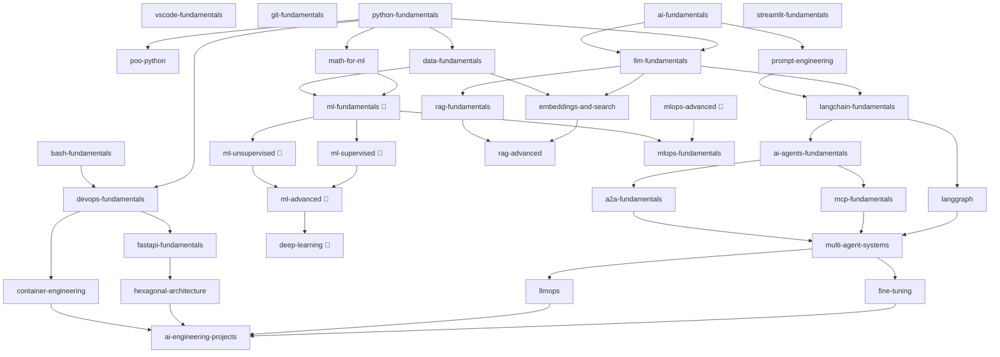

# AI Engineering Roadmap 🧠

> Un ecosistema estructurado y de código abierto de repositorios para convertirse en ingeniero de IA — desde los fundamentos hasta sistemas listos para producción.

---

## ¿Qué es esto?

Es un ecosistema curado de repositorios de GitHub que cubre todo lo que necesitas para convertirte en ingeniero de IA. Cada repositorio se centra en un tema específico, tiene requisitos previos claros y desbloquea nuevos repositorios al completarse.

El contenido combina:
- 📖 Teoría en Markdown — explicaciones claras, diagramas y ejemplos.
- 💻 Notebooks ejecutables — código paso a paso, compatible con Google Colab y entornos locales.
- 🏗️ Proyectos guiados — proyectos del mundo real con soluciones de referencia y tests automatizados.

---

## Cómo navegar este roadmap

Cada repositorio pertenece a una capa. Debes completar una capa antes de pasar a la siguiente, pero dentro de una capa puedes seguir tu propio orden según tus intereses y conocimientos previos.

Cada repositorio especifica:
- **Requisitos previos** — lo que debes saber antes de empezar.
- **Desbloquea** — lo que estará disponible una vez que lo completes.

Empieza aquí según tu nivel:

| Nivel | Empieza en |
|---|---|
| Principiante total | Capa 0 — Fundamentos de desarrollo |
| Sabes Python, nunca has tocado IA | Capa 1 — Fundamentos |
| Sabes Python y has usado APIs de LLM | Capa 2 — Construyendo con LLMs |
| Cómodo con RAG y LangChain | Capa 3 — Agentes de IA |

---

## Mapa del ecosistema

> 🔵 Prioridad baja — contenido complementario, se desarrollará después del itinerario principal.

---

## Índice de repositorios

### Capa 0 — Fundamentos de desarrollo

| Repositorio | Contenido | Requisitos previos | Desbloquea |
|---|---|---|---|
| `vscode-fundamentals` | VSCode, extensiones, atajos, configuración | — | toda la Capa 1 |
| `git-fundamentals` | Git, GitHub, flujo de trabajo, PRs | — | toda la Capa 1 |
| `bash-fundamentals` | Shell, flujos de terminal, scripting y automatización | — | `devops-fundamentals` |
| `python-fundamentals` | Python, tipos, funciones, buenas prácticas | — | `math-for-ml`, `data-fundamentals`, `llm-fundamentals`, `devops-fundamentals`, `poo-python` |
| `poo-python` | POO y patrones de diseño en Python (profundización) | `python-fundamentals` | — (refuerzo, no bloquea nada) |
| `ai-fundamentals` | Qué es la IA, tipos de modelos, conceptos clave | — | `llm-fundamentals`, `prompt-engineering` |

### Capa 1 — Fundamentos

| Repositorio | Contenido | Requisitos previos | Desbloquea |
|---|---|---|---|
| `math-for-ml` | Álgebra lineal, estadística, probabilidad | `python-fundamentals` | `embeddings-and-search`, `ml-fundamentals` |
| `data-fundamentals` | Pandas, NumPy, manipulación y exploración de datos | `python-fundamentals` | `embeddings-and-search`, `ml-fundamentals` |
| `llm-fundamentals` | Cómo funcionan los LLMs, tokenización, contexto, APIs | `python-fundamentals`, `ai-fundamentals` | `embeddings-and-search`, `rag-fundamentals`, `langchain-fundamentals` |
| `prompt-engineering` | Prompting, cadena de pensamiento, few-shot, system prompts | `ai-fundamentals` | `langchain-fundamentals` |
| `devops-fundamentals` | Docker, CI/CD, variables de entorno, despliegue básico | `python-fundamentals` | `fastapi-fundamentals`, `container-engineering` |
| `ml-fundamentals` 🔵 | Aprendizaje supervisado, regresión, clasificación, árboles | `math-for-ml`, `data-fundamentals` | `ml-supervised`, `ml-unsupervised`, `mlops-fundamentals` |

### Capa 2 — Construyendo con LLMs

| Repositorio | Contenido | Requisitos previos | Desbloquea |
|---|---|---|---|
| `embeddings-and-search` | Embeddings, búsqueda semántica, bases de datos vectoriales | `llm-fundamentals`, `data-fundamentals` | `rag-fundamentals`, `rag-advanced` |
| `rag-fundamentals` | RAG básico, chunking, recuperación, generación | `embeddings-and-search`, `llm-fundamentals` | `rag-advanced`, `ai-agents-fundamentals` |
| `langchain-fundamentals` | LangChain, chains, integraciones, abstracciones clave | `llm-fundamentals`, `prompt-engineering` | `ai-agents-fundamentals`, `langgraph` |
| `fastapi-fundamentals` | FastAPI, arquitectura, endpoints, despliegue | `devops-fundamentals` | `hexagonal-architecture` |
| `streamlit-fundamentals` | Streamlit para prototipos y demos de IA | `python-fundamentals` | `ai-engineering-projects` |
| `ml-supervised` 🔵 | Regresión lineal, regresión logística, clasificación, validación | `ml-fundamentals` | `ml-advanced` |
| `ml-unsupervised` 🔵 | Clustering, PCA, reducción de dimensionalidad | `ml-fundamentals` | `ml-advanced` |

### Capa 3 — Agentes de IA

| Repositorio | Contenido | Requisitos previos | Desbloquea |
|---|---|---|---|
| `ai-agents-fundamentals` | Qué es un agente, patrones, herramientas, ReAct | `langchain-fundamentals`, `rag-fundamentals` | `langgraph`, `mcp-fundamentals`, `a2a-fundamentals` |
| `langgraph` | LangGraph, nodos, estado, flujos complejos | `langchain-fundamentals`, `ai-agents-fundamentals` | `multi-agent-systems` |
| `rag-advanced` | RAG avanzado, reranking, GraphRAG, evaluación | `rag-fundamentals`, `embeddings-and-search` | `llmops` |
| `mcp-fundamentals` | Model Context Protocol, servidores, clientes | `ai-agents-fundamentals` | `multi-agent-systems` |
| `a2a-fundamentals` | Protocolo agente a agente, comunicación entre agentes | `ai-agents-fundamentals` | `multi-agent-systems` |
| `multi-agent-systems` | Orquestación, supervisores, sistemas complejos | `langgraph`, `mcp-fundamentals`, `a2a-fundamentals` | `fine-tuning`, `llmops` |
| `ml-advanced` 🔵 | Series temporales, AutoML, ensamblados | `ml-supervised`, `ml-unsupervised` | `deep-learning` |
| `deep-learning` 🔵 | Redes neuronales, CNNs, transfer learning | `ml-advanced` | `fine-tuning` |

### Capa 4 — Ingeniería de IA avanzada

| Repositorio | Contenido | Requisitos previos | Desbloquea |
|---|---|---|---|
| `fine-tuning` | Fine-tuning de LLMs, LoRA, datasets, evaluación | `multi-agent-systems` | `ai-engineering-projects` |
| `llmops` | Observabilidad, trazas, evaluación de LLMs en producción | `multi-agent-systems`, `rag-advanced` | `ai-engineering-projects` |
| `hexagonal-architecture` | Arquitectura hexagonal y limpia aplicada a la IA | `fastapi-fundamentals` | `ai-engineering-projects` |
| `container-engineering` | Docker avanzado, orquestación, Kubernetes básico | `devops-fundamentals` | `ai-engineering-projects` |
| `mlops-fundamentals` | MLOps, versionado de modelos, pipelines | `ml-fundamentals` | `mlops-advanced` |
| `mlops-advanced` 🔵 | Pipelines avanzados, feature stores, monitorización de modelos | `mlops-fundamentals` | `ai-engineering-projects` |

### Capa 5 — Proyectos

| Repositorio | Contenido | Requisitos previos |
|---|---|---|
| `ai-engineering-projects` | Proyectos integrativos de extremo a extremo | varios repositorios de la Capa 4 |

---

## Estado de los repositorios

| Repositorio | Estado |
|---|---|
| `ai-engineering-roadmap` | 🟡 En progreso |
| `ai-engineering-agents` | 🟡 En progreso |
| `git-fundamentals` | 🟢 Completo |
| `bash-fundamentals` | 🟢 Completo |
| `python-fundamentals` | 🟡 En progreso |
| `poo-python` | 🟢 Completo |
| `fastapi-fundamentals` | 🟢 Completo |
| `devops-fundamentals` | 🟢 Completo |
| `hexagonal-architecture` | 🟢 Completo |
| Todos los demás | ⚪ Planificado |

---

## Contribuciones

Este es un proyecto de código abierto y las contribuciones son bienvenidas. Por favor, lee el [CONTRIBUTING.md](./CONTRIBUTING.md) antes de enviar una PR.

---

## Licencia

Licencia MIT — consulta [LICENSE](./LICENSE) para más detalles.

---

*Hecho con ❤️ por [supernovaIa](https://github.com/supernovaIa)*
