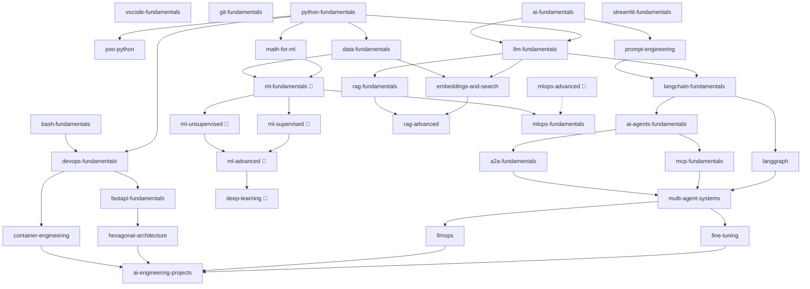

# AI Engineering Roadmap 🧠

> A structured, open-source ecosystem of repositories to become an AI engineer — from foundations to production-ready systems.

---

## What is this?

This is a curated ecosystem of GitHub repositories that covers everything you need to become an AI engineer. Each repository focuses on a specific topic, has clear prerequisites, and unlocks new repositories once completed.

The content combines:
- 📖 Theory in Markdown — clear explanations, diagrams and examples.
- 💻 Executable notebooks — step-by-step code, compatible with Google Colab and local environments.
- 🏗️ Guided projects — real-world projects with reference solutions and automated tests.

---

## How to navigate this roadmap

Each repository belongs to a layer. You should complete a layer before moving to the next, but within a layer you can follow your own order based on your interests and background.

Every repository specifies:
- **Prereqs** — what you should know before starting.
- **Unlocks** — what becomes available once you complete it.

Start here depending on your background:

| Background | Start at |
|---|---|
| Complete beginner | Layer 0 — Dev foundations |
| Know Python, never touched AI | Layer 1 — Foundations |
| Know Python and have used LLM APIs | Layer 2 — Building with LLMs |
| Comfortable with RAG and LangChain | Layer 3 — AI agents |

---

## Ecosystem map

> 🔵 Lower priority — complementary content, will be developed after the core track.

---

## Repository index

### Layer 0 — Dev foundations

| Repository | Content | Prereqs | Unlocks |
|---|---|---|---|
| `vscode-fundamentals` | VSCode, extensions, shortcuts, configuration | — | all Layer 1 |
| `git-fundamentals` | Git, GitHub, workflow, PRs | — | all Layer 1 |
| `bash-fundamentals` | Shell, terminal workflows, scripting and automation | — | `devops-fundamentals` |
| `python-fundamentals` | Python, types, functions, best practices | — | `math-for-ml`, `data-fundamentals`, `llm-fundamentals`, `devops-fundamentals`, `poo-python` |
| `poo-python` | OOP and design patterns in Python (deep-dive) | `python-fundamentals` | — (reinforcement, doesn't gate anything) |
| `ai-fundamentals` | What is AI, model types, key concepts | — | `llm-fundamentals`, `prompt-engineering` |

### Layer 1 — Foundations

| Repository | Content | Prereqs | Unlocks |
|---|---|---|---|
| `math-for-ml` | Linear algebra, statistics, probability | `python-fundamentals` | `embeddings-and-search`, `ml-fundamentals` |
| `data-fundamentals` | Pandas, NumPy, data manipulation and exploration | `python-fundamentals` | `embeddings-and-search`, `ml-fundamentals` |
| `llm-fundamentals` | How LLMs work, tokenization, context, APIs | `python-fundamentals`, `ai-fundamentals` | `embeddings-and-search`, `rag-fundamentals`, `langchain-fundamentals` |
| `prompt-engineering` | Prompting, chain of thought, few-shot, system prompts | `ai-fundamentals` | `langchain-fundamentals` |
| `devops-fundamentals` | Docker, CI/CD, environment variables, basic deployment | `python-fundamentals` | `fastapi-fundamentals`, `container-engineering` |
| `ml-fundamentals` 🔵 | Supervised learning, regression, classification, trees | `math-for-ml`, `data-fundamentals` | `ml-supervised`, `ml-unsupervised`, `mlops-fundamentals` |

### Layer 2 — Building with LLMs

| Repository | Content | Prereqs | Unlocks |
|---|---|---|---|
| `embeddings-and-search` | Embeddings, semantic search, vector databases | `llm-fundamentals`, `data-fundamentals` | `rag-fundamentals`, `rag-advanced` |
| `rag-fundamentals` | Basic RAG, chunking, retrieval, generation | `embeddings-and-search`, `llm-fundamentals` | `rag-advanced`, `ai-agents-fundamentals` |
| `langchain-fundamentals` | LangChain, chains, integrations, key abstractions | `llm-fundamentals`, `prompt-engineering` | `ai-agents-fundamentals`, `langgraph` |
| `fastapi-fundamentals` | FastAPI, architecture, endpoints, deployment | `devops-fundamentals` | `hexagonal-architecture` |
| `streamlit-fundamentals` | Streamlit for AI prototypes and demos | `python-fundamentals` | `ai-engineering-projects` |
| `ml-supervised` 🔵 | Linear regression, logistic regression, classification, validation | `ml-fundamentals` | `ml-advanced` |
| `ml-unsupervised` 🔵 | Clustering, PCA, dimensionality reduction | `ml-fundamentals` | `ml-advanced` |

### Layer 3 — AI agents

| Repository | Content | Prereqs | Unlocks |
|---|---|---|---|
| `ai-agents-fundamentals` | What is an agent, patterns, tools, ReAct | `langchain-fundamentals`, `rag-fundamentals` | `langgraph`, `mcp-fundamentals`, `a2a-fundamentals` |
| `langgraph` | LangGraph, nodes, state, complex flows | `langchain-fundamentals`, `ai-agents-fundamentals` | `multi-agent-systems` |
| `rag-advanced` | Advanced RAG, reranking, GraphRAG, evaluation | `rag-fundamentals`, `embeddings-and-search` | `llmops` |
| `mcp-fundamentals` | Model Context Protocol, servers, clients | `ai-agents-fundamentals` | `multi-agent-systems` |
| `a2a-fundamentals` | Agent-to-Agent protocol, inter-agent communication | `ai-agents-fundamentals` | `multi-agent-systems` |
| `multi-agent-systems` | Orchestration, supervisors, complex systems | `langgraph`, `mcp-fundamentals`, `a2a-fundamentals` | `fine-tuning`, `llmops` |
| `ml-advanced` 🔵 | Time series, AutoML, ensembles | `ml-supervised`, `ml-unsupervised` | `deep-learning` |
| `deep-learning` 🔵 | Neural networks, CNNs, transfer learning | `ml-advanced` | `fine-tuning` |

### Layer 4 — Advanced AI engineering

| Repository | Content | Prereqs | Unlocks |
|---|---|---|---|
| `fine-tuning` | LLM fine-tuning, LoRA, datasets, evaluation | `multi-agent-systems` | `ai-engineering-projects` |
| `llmops` | Observability, tracing, LLM evaluation in production | `multi-agent-systems`, `rag-advanced` | `ai-engineering-projects` |
| `hexagonal-architecture` | Hexagonal and clean architecture applied to AI | `fastapi-fundamentals` | `ai-engineering-projects` |
| `container-engineering` | Advanced Docker, orchestration, basic Kubernetes | `devops-fundamentals` | `ai-engineering-projects` |
| `mlops-fundamentals` | MLOps, model versioning, pipelines | `ml-fundamentals` | `mlops-advanced` |
| `mlops-advanced` 🔵 | Advanced pipelines, feature stores, model monitoring | `mlops-fundamentals` | `ai-engineering-projects` |

### Layer 5 — Projects

| Repository | Content | Prereqs |
|---|---|---|
| `ai-engineering-projects` | End-to-end integrative projects | multiple Layer 4 repos |

---

## Repository status

| Repository | Status |
|---|---|
| `ai-engineering-roadmap` | 🟡 In progress |
| `ai-engineering-agents` | 🟡 In progress |
| `git-fundamentals` | 🟢 Complete |
| `bash-fundamentals` | 🟢 Complete |
| `python-fundamentals` | 🟡 In progress |
| `poo-python` | 🟢 Complete |
| `fastapi-fundamentals` | 🟢 Complete |
| `devops-fundamentals` | 🟢 Complete |
| `hexagonal-architecture` | 🟢 Complete |
| All others | ⚪ Planned |

---

## Contributing

This is an open-source project and contributions are welcome. Please read the [CONTRIBUTING.md](./CONTRIBUTING.md) before submitting a PR.

---

## License

MIT License — see [LICENSE](./LICENSE) for details.

---

*Built with ❤️ by [supernovaIa](https://github.com/supernovaIa)*